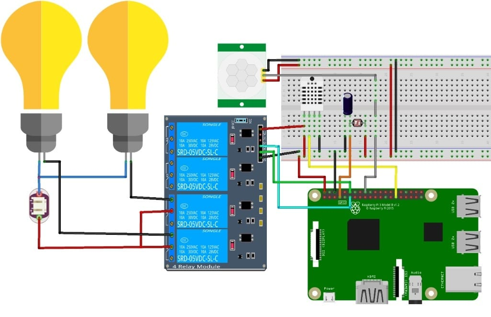
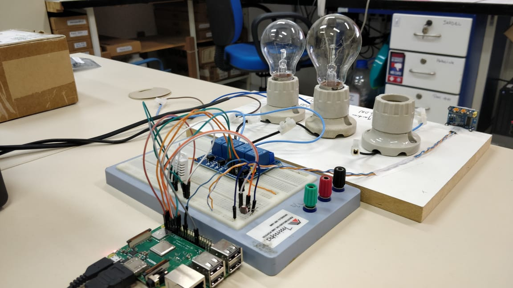
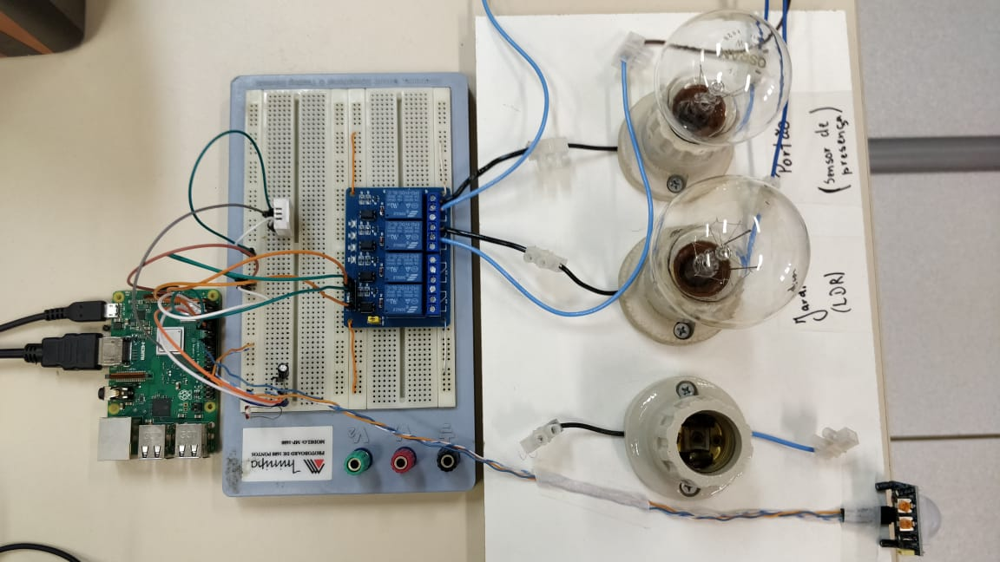
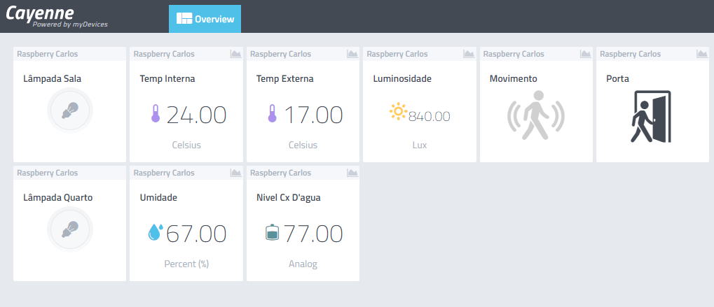

# Casa Inteligente


## Introdução

Projeto de Casa Inteligente da disciplina de SISTEMAS MICROPROCESSADOS AVANÇADOS/2020B. Utilizando Raspberry PI e My Device Cayenne.

### Requisitos
+ [Python 3.4+](https://www.python.org/downloads/) Já vem pré instalado na versão completa do Raspberry Pi OS.
+ [Eclipse Paho MQTT Python client library](https://github.com/eclipse/paho.mqtt.python)
+ [Eclipse Paho MQTT Python client library](https://github.com/eclipse/paho.mqtt.python)

## Instruções para rodar o projeto
Passo a passo para rodar o código e visualizar os resultados obtidos com o projeto.

### GPIO
+ GPIO 4 - Sensor de Luminosidade LDR (ENTRADA)
+ GPIO 5 - Sensor de Temperatura DHT22 (ENTRADA)
+ GPIO 17 - Sinal Lâmpada (SAÍDA)
+ GPIO 18 - Sinal Lâmpada (SAÍDA)
+ GPIO 24 - Sensor de Presença DHT22 (ENTRADA)

### Cabeamento
<p style="text-align:center"><br/><br/><br/></p>
<p style="text-align:center"><br/><br/><br/></p>
<p style="text-align:center"><br/><br/><br/></p>


Instalação
------------
Para realizar a instalação do projeto é preciso clonar o repositório:
```
git clone https://github.com/carlosely/micros-MQTT/
```
  
  
E rodar a configuração:
```
  cd micros-MQTT/Cayenne-MQTT-Python/
  sudo python3 setup.py install
```

**OBS:** sempre que for feita alguma alteração no arquivo *client.py* a configuração *sudo python3 setup.py install* deve ser executada novamente.

Execução
------------
Para executar o código do projeto basta rodar o arquivo:
```
  Projeto2.py
 ``` 
 
### Visualização
Com o código rodando é possível acessar o [Link](https://cayenne.mydevices.com/shared/5f7e50879abe4a5bb3166cda/project/2cfe19ee-efe1-4035-9089-f0e02559217a) que levará à plataforma My Device Cayenne para visualizar a tela de automação.

<p style="text-align:center"><br/><br/><br/></p>

**Uma tela semelhante a essa deve aparecer**
